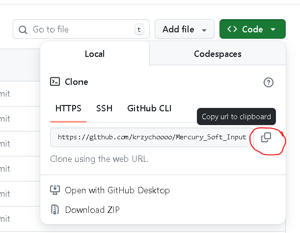
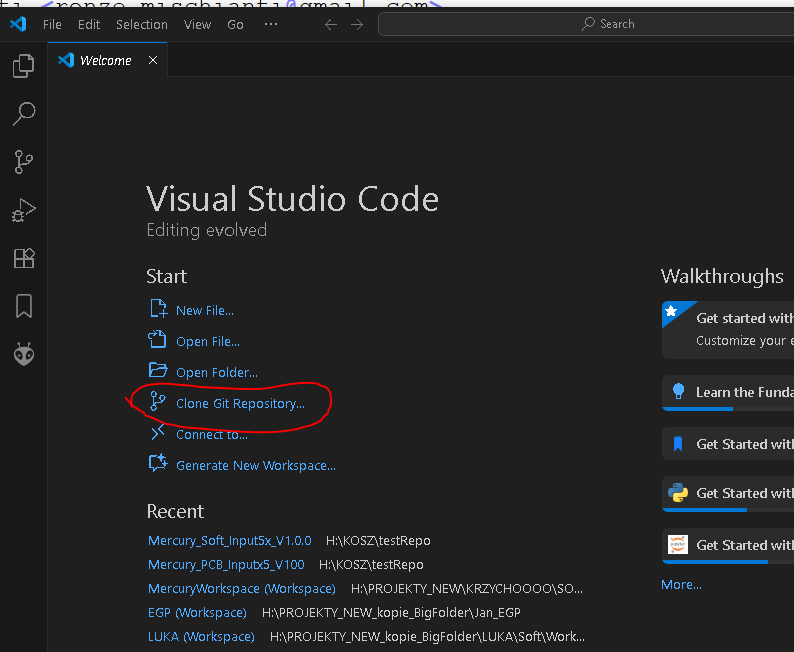

# Mercury_Soft_Input5x_V1.0.0
This software is used to test the PCB module.
The library used is:
`name=PCF8574 library
version=2.3.7
author=Renzo Mischianti <renzo.mischianti@gmail.com>
maintainer=Renzo Mischianti <renzo.mischianti@gmail.com>
sentence=Most starred PCF8574 library for Arduino (standard and SAMD), Raspberry Pi Pico and rp2040 boards, ESP8266, smt32 and esp32
paragraph=Most starred PCF8574 library. i2c digital expander for Arduino (standard and SAMD), esp32, Raspberry Pi Pico and rp2040 boards, SMT32 and ESP8266. Can read write digital values with only 2 wire. Very simple to use and encoder support.
category=Signal Input/Output
url=https://www.mischianti.org/category/my-libraries/pcf8574/
repository=https://github.com/xreef/PCF8574_library
architectures=*
includes=PCF8574.h`
## How to use:

 - Copy the link to the repository.
 - Open VSC and File -> New Window
 - Click Clone repository.
 
 